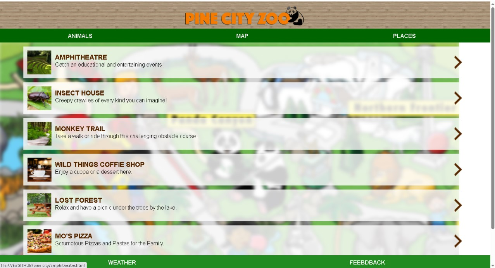
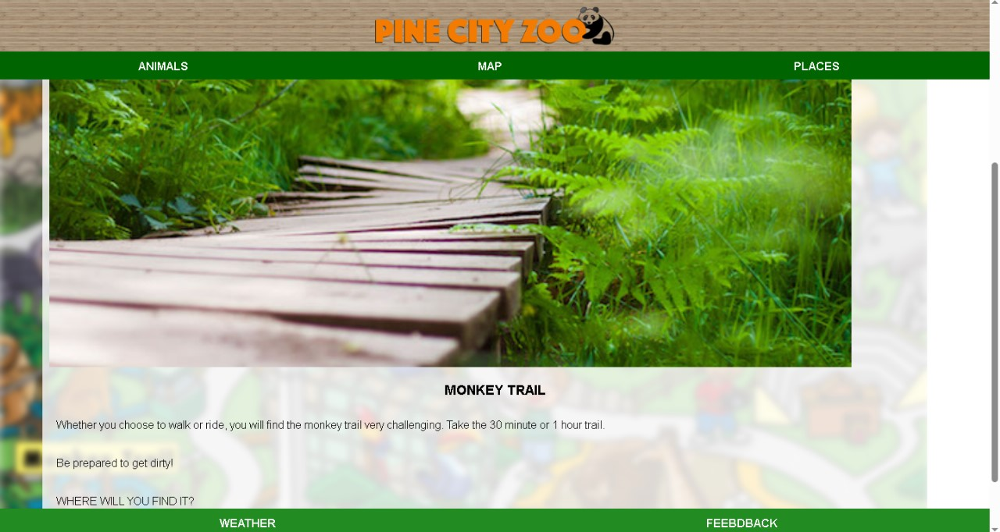
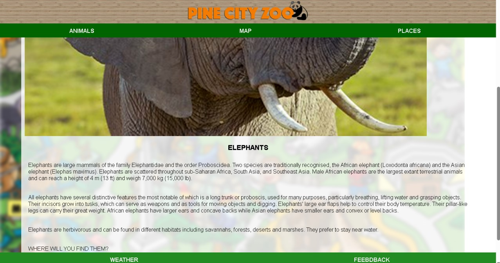
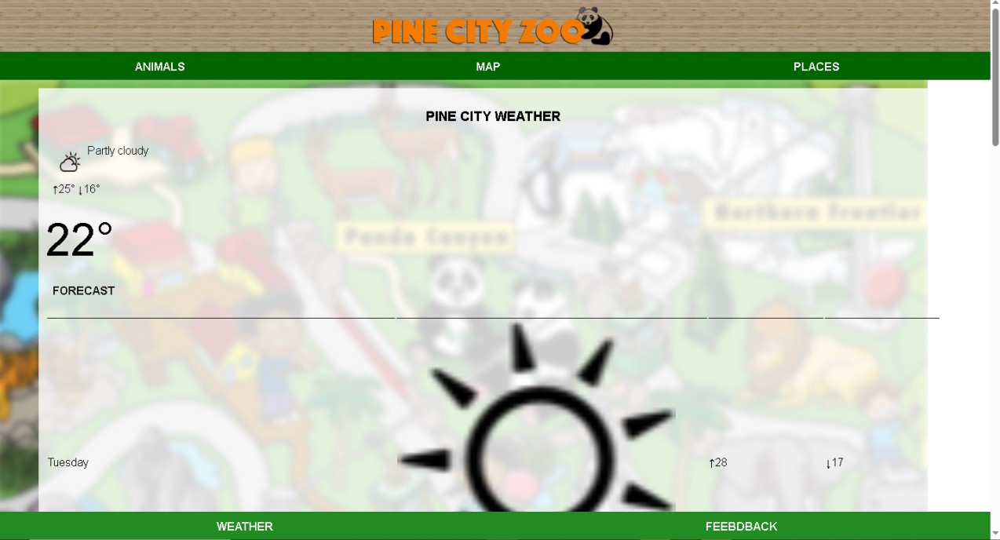
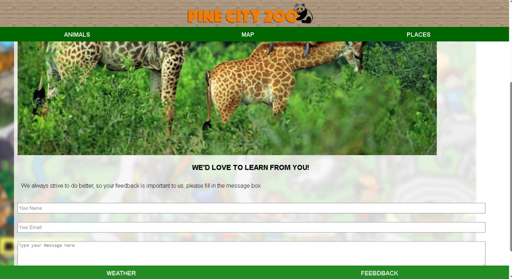

# Pine City Zoo Website

This is a multi-page website for Pine City Zoo, created using HTML and CSS. The site showcases different animals, visitor information, event details, weather updates, and more.

## Key Pages

- `index.html` — Main homepage  
- `Animals.html` — Overview of zoo animals  
- `amphitheatre.html` — Event and show listings  
- `weather.html` — Local weather forecast  
- `feedback.html` — Visitor feedback form  
- Various animal pages like `lion.html`, `koala.html`, `monkey.html`, etc.

## Technologies Used

- HTML5  
- CSS3  
- Basic JavaScript (if applicable)  

## How to View the Site Locally

1. Download or clone this repository.  
2. Open `index.html` in your web browser.

   ## Project Screenshots

### Map

### Places Menu

### Inside Places

### Animals

### Weather

### Message Area

### Message Received Area

---

*Project by Banele Nelson Ntuli*  
*GitHub: [Banelenelson02](https://github.com/Banelenelson02)*
